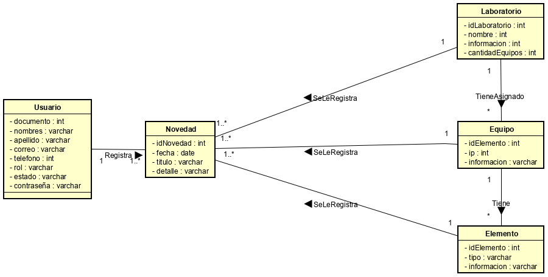

# 2020-2-PROYCVDS-LOS-DISCIPULOS-DEL-MAESTRO-MIGUELITO

  

### La Plataforma Historial de Equipos

## Proyecto Final: Ciclos de Vida de Desarrollo de Software 2020-2. 

## Dicipulos del Maestro Miguelito

- Miguel Angel Rodriguez Siachoque (Team Developer)
- James Alexander Torres Segura (Team Developer)
- Daniel Santiago Ducuara Ardila (Team Developer)

## Tutores

- Julián Mauricio Velazco Briceño (Product Owner)
- Oscar David Ospina Rodriguez (Product Owner)

## Descripción del producto:

## *Descripción general.*

La Plataforma Historial de Equipos, es una herramienta donde el personal del laboratorio de informática (LabInfo) pertenecientes a la decanatura de Ingeniería de Sistemas de la Escuela Colombiana de Ingeniería Julio Garavito, pueden registrar los laboratorio, equipos y elementos de cada equipo, junto con las novedades que se realizan a cada uno de estos. 
El sistema, más allá de facilitar el registro de los equipos y novedades, es una valiosa base de conocimiento donde el personal del laboratorio, puede revisar el histórico de novedades que se le han realizado a cada elemento a través del tiempo durante todo su ciclo de vida útil. 
El personal administrativo del laboratorio puede crear laboratorios, equipos y elementos, asociar unos a otros y registrar novedades para cada uno; además de tener una variedad de reportes que les permitirá tener el control administrativo de estos implementos.

## *Manual de usuario:*

## *Arquitectura y Diseño detallado:*

Modelo E-R.

Diagrama de clases

## *Descripción de la arquitectura y tecnología usadas durante el proyecto:*

Durante la elaboracion del proyecto logramos dar uso en:

- Capa de aplicación:
  Google guice, apache shiro y maven
  

- Capa de presentación
  primefaces, JSF 
  

- Capa de persistencia
  En esta capa usamos MyBatis y una base de datos PostgreSQL
  

## sistema de integración continua Circle Ci

## Codacy

## Enlace de la Pagina Web en Heroku

## *Descripción del proceso:*

Integrantes.

Miguel Angel Rodriguez Siachoque encargado de la implementacion de las VIEWS y BACKEN
James Alexander Torres Segura encargado de la implementacion BACKEN
Daniel Santiago Ducuara Ardila encargado de la implementacion BD y BACKEN

## Enlace Taiga
https://tree.taiga.io/project/jamestorres99-historial-de-equipos-labinfo/backlog

## descripción de la Metodología.

